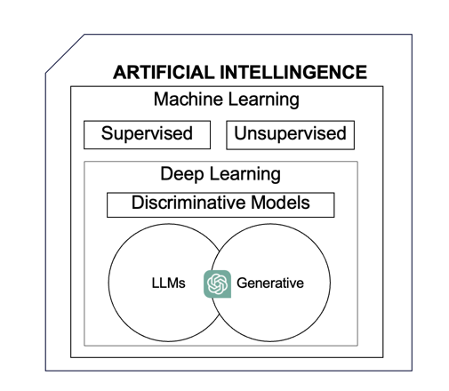
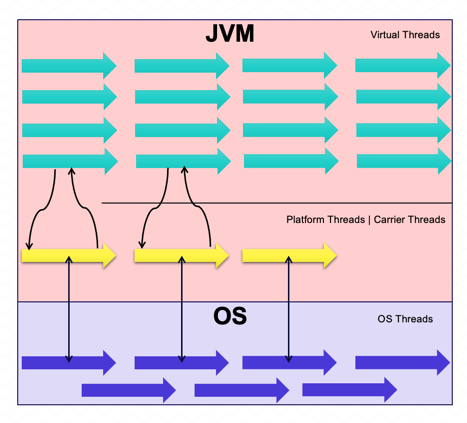

# LLM/AI Applications in The Land of Java: Virtual Threads, Vector Databases and Spring AI

## Agenda

1. [Introduction](#introduction)
2. [Introduction to AI](#introduction-to-ai)
3. [Virtual Threads](#virtual-threads)
4. [Vector Databases](#vector-databases)
5. [Spring AI](#spring-ai)

## Introduction

    My name is Liviu Spiroiu, and I am a 

        1. Microservices & Cloud focused Java Developer, 
        2. Agile & Scrum Advocate, Team & Tech Leader, 
        3. Technology Public Speaker.
    
    What I am not is an AI Expert.
    But using the technologies that I am going to present in this document
    I will show you that it is not only possible but easy for all Java & Spring Developers 
    to integrate LLMs in their existing infrastructure with minimal knowledge of the ML field.
    
    
    
## Introduction to AI


    First it is very important to understand that Artificial Intelligence like Physics for example 
    is an entire field of study.  Then you have Machine Learning as a subfield the same way you have 
    for example Mechanics in Physics.  
    Deep Learning is again a subset of Machine Learning that can be further broken down based 
    on model types into: 
        
        1. Discriminative Models, 
        2. Large Language Models and,
        3. Generative AI in general. 

    And in the overlap between the two is where we can find tools like ChatGPT.    
    Machine Learning is a program that takes in data which is used to train a model. 
    This model, after being trained, can take in new data and make valid predictions without ever having seen that data before.  
    There are two common types of Machine Learning models: 
    - Supervised,
    - Unsupervised.  

    Supervised models use previously labeled data while unsupervised models use unlabeled data, 
    and unlike the unsupervised ones, the supervised models will compare the newly generated prediction with
    the training data and try to minimize the gap.

    Going even deeper, pun intended.  
    Deep Learning is a type of Machine Learning that uses Artificial Neural Networks. 
    These are networks comprised of layers and generally the more layers a network has the better the model. 
    Generally.    

    The main thing you need to know is that Deep Learning allows model to do something called Semi-Supervised Learning. 
    That means that the model is trained on a small sample of labeled data, and then that knowledge is used to train 
    the model even more on a larger set of unlabeled data. And that is a very powerful capability.   

    If we were to consider their main usage, discriminative models are generally used for classification:
    is the input a cat or dog?  
    On the other hand, Generative Models learn about the patterns found in the training data and based on the input 
    and the patterns they generate new samples of content.

    And finally, we reach the field of Large Language Models.  
    It is important to understand that even though there is overlap between LLMs and GenAI as we saw before, 
    they are not the same thing.  

    There are multiple differences between the two types of models, but the one thing I want you to remember is 
    the fact that LLMs are generally pre-trained with a VERY large set of data, 
    and then they are finetuned for specific purposes.   
    
    Continuing with the cats and dogs theme, it’s ok to train all dogs to sit, fetch, lay down or to stay, 
    but then you can go further with the specialized training if the dog is used for specific task like 
    hunting, police or support.


## Virtual Threads


    1. Platform Threads: These are the traditional threads in Java, managed by the operating system (OS). 
    Platform threads are backed by OS threads, meaning the OS handles their scheduling, execution, 
    and lifecycle management.  
    
    2. Carrier Threads: In the context of virtual threads, carrier threads are a subset of platform threads 
    that the JVM uses to execute virtual threads. Virtual threads do not have dedicated OS threads; instead, 
    they are scheduled onto carrier threads, which act as the "carriers" or 
    "executors" for virtual threads when they run.  

    3.  Virtual Threads: These are lightweight, user-level threads managed by the Java Virtual Machine (JVM), 
    not directly mapped to OS threads. Multiple virtual threads can run on a single OS thread. 
    When a virtual thread encounters a blocking operation, it is detached from the carrier thread (the OS thread), 
    freeing the carrier thread to run other virtual threads.    

    Key Considerations:

        - Avoid Pooling Virtual Threads: Virtual threads are lightweight and meant to be created and discarded as needed. 
        Pooling them would reduce their performance benefits. 
        Think of them like disposable items – use once and discard.
        
        - Ideal for I/O-bound Tasks: Virtual threads are well-suited for tasks that spend significant 
        time waiting for I/O operations. 
        For CPU-bound tasks, platform threads remain preferable.  
        
        - Use ExecutorService for Production: While creating virtual threads directly can be useful in prototyping, 
        an ExecutorService is recommended for production applications, as it provides better management and control 
        over thread creation and execution. 
    
## Vector Databases

    Vector databases are specialized systems designed for storing and querying vector embeddings, 
    which represent data like text, images, and audio in high-dimensional mathematical space. 
    Transforming PostgreSQL into a vector database is as simple as installing the pgvector extension. 
    This enables Postgres to support vector operations such as inner product, cosine distance, 
    and approximate nearest neighbor search, alongside traditional SQL functions.

    Key Considerations:

    - Vector Storage: The pgvector extension introduces a specific data type for high-dimensional vectors, 
    allowing users to define vector columns within tables. This supports the storage of complex data types, 
    such as embeddings generated by machine learning models. 

    - Semantic Search: Enables searches based on meaning rather than exact matches, enhancing recommendation 
    systems and content discovery.

    - Efficient Similarity Search: Optimized for high-dimensional nearest neighbor searches, 
    overcoming limitations found in traditional databases.

    - Integration with SQL: Allows vector similarity searches to be combined with standard SQL queries, 
    enabling complex data analysis.

## Spring AI
    
    There are several ways to interact with vector databases, but today we’ll focus on Spring AI’s integration 
    for Retrieval-Augmented Generation (RAG), where large language models (LLMs) are enhanced with 
    relevant context from your own data.

    Spring AI simplifies building RAG pipelines with these features:

    - Document Processing: Tools for reading various document formats (such as PDFs) 
    and splitting them into smaller chunks for embedding.

    - Vector Store Abstraction: A consistent interface for interacting with different vector databases, 
    including pgvector.

    - Query Language: A SQL-like language to make searching within the vector store straightforward.

    - Prompt Engineering: Tools to combine user prompts with relevant retrieved documents, 
    providing the LLM with enriched context for responses.

    The Key Steps for Implementing RAG with PostgreSQL and Spring AI are:

    - Embed Your Data: Transform your data (text, images, etc.) into vector embeddings using an embedding model. 
    Spring AI integrates with models like OpenAI for this purpose.

    - Store Embeddings in PostgreSQL: Use the pgvector extension in PostgreSQL to store these embeddings
    alongside related metadata.

    - And what you will find in the demo, is a Spring AI RAG Pipeline that:
        1. Accepts a user query
        2. Searches PostgreSQL for relevant documents using similarity search
        3. Enriches the user query with context retrieved from these documents
        4. Sends the enhanced prompt to the LLM.
```